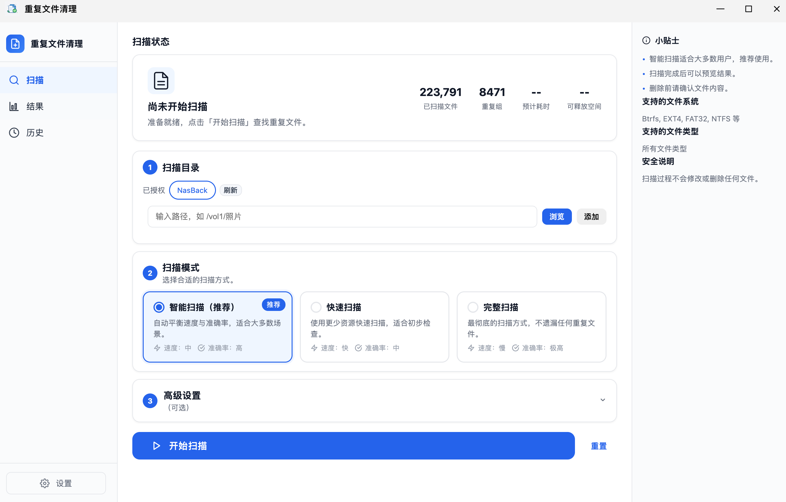
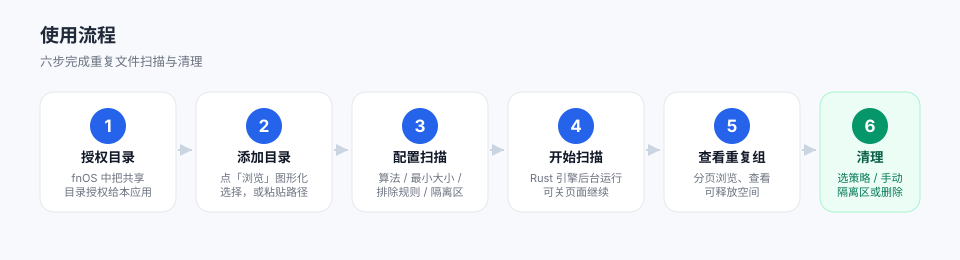

# 重复文件清理（dupclean）

  

  <b>飞牛（fnOS）第三方原生应用</b> · 基于文件内容哈希的精确重复文件查找与清理

  
  
  

扫描 NAS 指定目录下的重复文件，按**文件内容的哈希值**精确判重（不是只看文件名或大小），
支持图形化目录选择、Rust 引擎并行加速、多种删除策略，以及任务记录与后台运行。
以 **fnOS 原生应用**形态运行（非 Docker），不暴露任何 TCP 端口，仅能访问你已授权的目录。

---

## 功能特性

- **内容级精确判重**：同一大小的文件集合中再按完整哈希（SHA-256 / xxHash）确认重复，避免按文件名/大小误判。
- **Rust 高性能引擎**：纯内存批处理、无缓存，扫描完即出结果。
- **图形化目录选择**：点「浏览…」逐级浏览 NAS 目录树、一键选入，也可手动粘贴路径。
- **多种删除策略**：保留最新/最旧、保留最大/最小、按目录优先级保留、保留前 N 个、手动逐文件勾选。
- **任务记录 + 后台运行**：扫描在后台持续执行，可随时关闭页面；重开应用后在「任务记录」查看已完成任务的重复组与统计。
- **最小权限 / 授权隔离**：以专用包用户运行，仅能读取你已在 fnOS 授权的目录；撤销授权后，相关历史任务的操作会被拒绝。

---

## 界面预览

> 左侧为「任务记录」，右侧为扫描设置、实时进度与重复文件组列表。界面为示意，实际以 fnOS 中运行效果为准。

---

## 安装

1. **下载安装包**：在仓库 [Releases](https://github.com/QickBlue/fnos_dupclean/releases) 下载最新 `dupclean_vX.Y.Z.fpk`。
2. **手动安装**：fnOS → 应用中心 → 手动安装（上传 `.fpk`）。
3. **授权目录（必须）**：在 fnOS 中，对希望扫描的共享目录，把本应用（包用户 `dupclean`）加入**可读**权限。未授权的目录在「添加目录」时会被拒绝。

---

## 使用流程

**第 1 步 · 授权目录**
在 fnOS 的共享目录权限设置里，把「重复文件清理」加入目标目录的**可读**权限。这是扫描与删除的前提。

**第 2 步 · 添加目录**
在应用「扫描目录」处点「浏览…」图形化选择，或手动粘贴路径后点「添加目录」。可一次添加多个目录。

**第 3 步 · 配置扫描**
在「扫描设置」中按需调整：

| 选项 | 说明 | 默认值 |
|------|------|--------|
| 哈希算法 | `SHA-256`（最稳、跨平台可校验）/ `xxHash`（更快） | SHA-256 |
| 最小文件大小 | 低于此值的文件跳过，单位 Byte；设 `0` 表示不限制 | 0 |
| 排除规则 | 逗号分隔的目录名/文件名，支持子串匹配 | 空 |
| 包含隐藏文件 | 是否扫描以 `.` 开头的隐藏项 | 否 |
| 并行线程 | 哈希并行度，`0` = 自动（机械盘自动降速） | 自动 |
| 文件类型筛选 | 全部 / 图片 / 视频 / 文档 / 压缩包 / 其他 | 全部 |

**第 4 步 · 开始扫描**
点「开始扫描」。Rust 引擎在**后台**运行，页面可关闭；重新打开应用会自动续接进度。
扫描进度为**全局累积百分比**（遍历 → 预哈希 → 全量哈希 → 收尾）

**第 5 步 · 查看重复组**
扫描完成后在「任务记录」点「查看结果」。重复组以分页形式加载，每组显示文件大小、副本数、可释放空间与总统计。

**第 6 步 · 选择策略 / 执行清理**
对全部或选中的重复组指定删除策略（见下表），或切到「手动勾选」逐文件选择要删的项。
可一次清理「全部 / 当前页 / 前 N 组」。确认无误后点「执行清理」。

---

## 删除策略说明

| 策略 | 行为 |
|------|------|
| `keep_newest` 保留最新修改 | 每组保留修改时间最新的 1 个，删除其余 |
| `keep_oldest` 保留最旧修改 | 每组保留修改时间最旧的 1 个，删除其余 |
| `keep_largest` 保留最大文件 | 每组保留体积最大的 1 个，删除其余 |
| `keep_smallest` 保留最小文件 | 每组保留体积最小的 1 个，删除其余 |
| `keep_dir_priority` 按目录优先级 | 保留优先级最高目录中的副本，删除其他目录的副本 |
| `keep_n` 保留前 N 个 | 每组保留最新的 N 个副本，删除其余 |
| `manual` 手动勾选 | 在前端逐文件勾选要删除的文件 |

---

## ⚠️ 注意事项（必读）

> **执行清理为「直接物理删除」，不经过系统回收站，删除后通常无法恢复。** 请务必在执行前确认策略与勾选无误。

- **删除不可恢复**：本应用的清理是物理删除，没有「回收站 / 撤销」机制。删除前请仔细核对重复组与选中文件。
- **先小范围验证**：首次使用建议先在一个你熟悉的目录（如「下载」）试跑，确认判重与策略符合预期，再扩大到照片、备份等大目录。
- **不要扫描系统/应用目录**：避免把 `/`、`@app`、`@appmeta`、其他应用的私有目录等加入扫描，误删系统文件可能导致 fnOS 异常。
- **授权目录即权限边界**：应用只能扫描/删除你已授权的目录。在 fnOS 中**撤销某目录授权**后，该目录相关的历史任务「浏览 / 预览 / 删除」操作会被拒绝——这是安全设计，不是故障。
- **机械盘请耐心**：扫描机械硬盘（HDD）大目录时耗时较长，且引擎会自动降低并行度以避免磁头频繁寻道。这是正常现象，扫描在后台进行，不影响你做其他事。
- **扫描设置的意义**：设「最小文件大小」可跳过海量小文件、显著加快扫描；「排除规则」可避开无需判重的目录（如 `.git`、`node_modules`）。

---

## 常见问题（FAQ）

**Q：添加目录时提示「未授权」？**
A：到 fnOS 的共享目录权限里，把「重复文件清理」加入该目录的**可读**权限，再回来添加。

**Q：扫描很慢？**
A：大目录、机械盘、文件数量多都会变慢；引擎已针对机械盘自动降速保护。可设「最小文件大小」过滤小文件、用「排除规则」跳过无关目录来加速。

**Q：误删了文件能恢复吗？**
A：本应用为直接物理删除，通常不提供恢复。请在执行清理前确认无误；重要数据务必先有其他备份。

**Q：历史任务的目录被撤销授权了，还能删吗？**
A：不能。出于安全考虑，授权范围外的历史任务相关操作会被拒绝，需重新对该目录授权后再操作。

---

